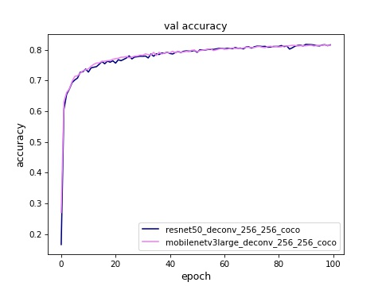
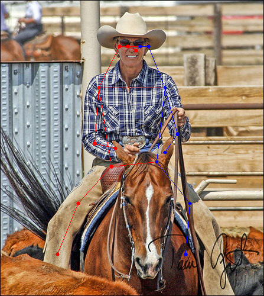
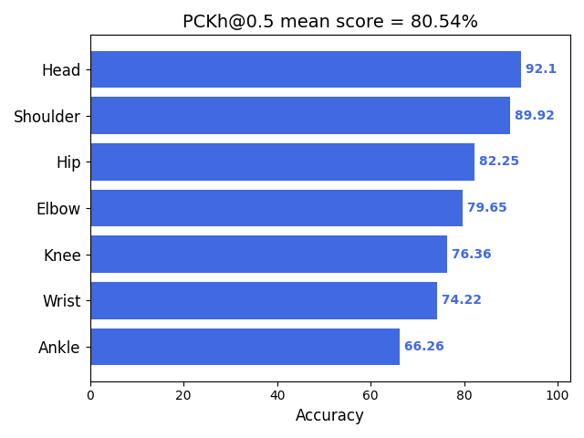

# TF Keras Simple Baselines Model for Keypoint Estimation

[](LICENSE)

## Introduction

An end-to-end single-object keypoint estimation pipeline with Simple Baselines models, implemented with tf.keras and support different backbones & different head architecture:

#### Backbone
- [x] ResNet50
- [x] MobileNetV1
- [x] MobileNetV2
- [x] MobileNetV3(Large/Small)
- [x] PeleeNet([paper](https://arxiv.org/abs/1804.06882))
- [x] GhostNet([paper](https://arxiv.org/abs/1911.11907))

#### Head
- [x] Standard Deconv (Conv2DTranspose) block
- [x] Simple Upsample (UpSampling2D+Conv2D) block
- [x] Light Upsample (UpSampling2D+SeparableConv2D) block

#### Loss
- [x] Mean Squared Error loss
- [x] Mean Absolute Error loss
- [x] Weighted Mean Squared Error loss
- [x] Smooth L1 loss
- [x] Huber loss

#### Train tech
- [x] Transfer training from ImageNet
- [x] Dynamic learning rate decay (Cosine/Exponential/Polynomial/PiecewiseConstant)
- [x] Mixed precision training (valid for TF-2.1 and later)
- [x] Multi-GPU training with SyncBatchNorm support (valid for TF-2.2 and later)

#### On-device deployment
- [x] Tensorflow-Lite Float32/UInt8 model inference
- [x] MNN Float32/UInt8 model inference

## Guide of train/evaluate/demo

Install requirements on Ubuntu 16.04/18.04:

```
# apt install python3-opencv
# pip install -r requirements.txt
```

### Train
1. Prepare dataset
    1. MPII Human Pose Dataset
        * Download & extract MPII dataset image package and annotation package to `data/mpii`:

            ```
            # mkdir -p data/mpii
            # cd data/mpii
            # wget https://datasets.d2.mpi-inf.mpg.de/andriluka14cvpr/mpii_human_pose_v1.tar.gz
            # wget https://datasets.d2.mpi-inf.mpg.de/andriluka14cvpr/mpii_human_pose_v1_u12_2.zip
            # tar xzvf mpii_human_pose_v1.tar.gz
            # unzip -e mpii_human_pose_v1_u12_2.zip
            ```
        * use [mpii_annotation.py](https://github.com/david8862/tf-keras-simple-baselines-keypoint-detection/blob/master/tools/dataset_converter/mpii_annotation.py) to generate our annotation json file "annotations.json" from official annotation:

            ```
            # cd tools/dataset_converter/ && python mpii_annotation.py -h
            usage: mpii_annotation.py [-h] --mat_file MAT_FILE [--output_file OUTPUT_FILE]
                                      [--val_split VAL_SPLIT] [--single_only]

            Parse MPII dataset .mat annotation to our json annotation file

            optional arguments:
              -h, --help            show this help message and exit
              --mat_file MAT_FILE   MPII mat file
              --output_file OUTPUT_FILE
                                    output json annotation file,
                                    default=./train_annotations.json
              --val_split VAL_SPLIT
                                    validation data persentage in dataset, default=0.1
              --single_only         only include single person sample

            # python mpii_annotation.py --mat_file=../../data/mpii/mpii_human_pose_v1_u12_2/mpii_human_pose_v1_u12_1.mat --output_file=../../data/mpii/annotations.json --val_split=0.1
            ```

    2. MSCOCO Keypoints 2014/2017 Dataset
        * Download & extract MSCOCO train/val image package and annotation package to `data/mscoco_2014(2017)`:
            ```
            # mkdir -p data/mscoco_2014
            # cd data/mscoco_2014
            # wget http://images.cocodataset.org/zips/train2014.zip
            # wget http://images.cocodataset.org/zips/val2014.zip
            # wget http://images.cocodataset.org/annotations/annotations_trainval2014.zip
            # unzip train2014.zip -d images
            # unzip val2014.zip -d images
            # unzip annotations_trainval2014.zip
            #
            # mkdir -p data/mscoco_2017
            # cd ../data/mscoco_2017
            # wget http://images.cocodataset.org/zips/train2017.zip
            # wget http://images.cocodataset.org/zips/val2017.zip
            # wget http://images.cocodataset.org/annotations/annotations_trainval2017.zip
            # unzip train2017.zip -d images
            # unzip val2017.zip -d images
            # unzip annotations_trainval2017.zip
            ```
        * use [coco_annotation.py](https://github.com/david8862/tf-keras-simple-baselines-keypoint-detection/blob/master/tools/dataset_converter/coco_annotation.py) to generate our annotation json file "annotations.json" from official annotation:
            ```
            # cd tools/dataset_converter/ && python coco_annotation.py -h
            usage: coco_annotation.py [-h] --train_anno_path TRAIN_ANNO_PATH
                                      --val_anno_path VAL_ANNO_PATH
                                      [--output_anno_path OUTPUT_ANNO_PATH]
                                      [--output_class_path OUTPUT_CLASS_PATH]
                                      [--output_skeleton_path OUTPUT_SKELETON_PATH]

            Parse MSCOCO keypoint annotation to our annotation files

            optional arguments:
              -h, --help            show this help message and exit
              --train_anno_path TRAIN_ANNO_PATH
                                    MSCOCO keypoint train annotation file path
              --val_anno_path VAL_ANNO_PATH
                                    MSCOCO keypoint val annotation file path
              --output_anno_path OUTPUT_ANNO_PATH
                                    generated annotation json file path, default is
                                    ./annotations.json
              --output_class_path OUTPUT_CLASS_PATH
                                    generated keypoint classes txt file path, default is
                                    ./coco_classes.txt
              --output_skeleton_path OUTPUT_SKELETON_PATH
                                    generated keypoint skeleton txt file path, default is
                                    ./coco_skeleton.txt

            # python coco_annotation.py --train_anno_path=../../data/mscoco_2017/annotations/person_keypoints_train2017.json --val_anno_path=../../data/mscoco_2017/annotations/person_keypoints_val2017.json --output_anno_path=../../data/mscoco_2017/annotations.json
            ```

        * (Optional) Download MSCOCO [2014](https://drive.google.com/open?id=1jrxis4ujrLlkwoD2GOdv3PGzygpQ04k7)/[2017](https://drive.google.com/open?id=1YuzpScAfzemwZqUuZBrbBZdoplXEqUse) annotation json file to `data/mscoco_2014(2017)` and rename to "annotations.json"

    3. Customized keypoint dataset
        * Collecting your keypoint images and place to `data/<dataset_name>/images`
        * Generate keypoint annotation json file. The json content is a python list of dicts, for each should include at least following items:

            ```
            {
             'dataset': 'coco',
             'isValidation': 1.0,
             'img_paths': '000000000139.jpg',
             'objpos': [441.4, 217.267],
             'joint_self': [[428.0, 171.0, 1.0], [430.0, 170.0, 2.0], [1.0, 1.0, 0.0], [435.0, 169.0, 2.0], [1.0, 1.0, 0.0], [442.0, 178.0, 2.0], [447.0, 178.0, 2.0], [438.0, 201.0, 2.0], [431.0, 207.0, 2.0], [431.0, 221.0, 2.0], [421.0, 216.0, 2.0], [446.0, 227.0, 2.0], [453.0, 224.0, 2.0], [448.0, 261.0, 2.0], [455.0, 258.0, 2.0], [456.0, 291.0, 2.0], [460.0, 287.0, 2.0]],
             'scale_provided': 0.782
            }
            ```
            Put the annotation file to `data/<dataset_name>` and rename to "annotations.json"

            **NOTE**: for `objpos` annotation, you can use average of the valid keypoints coordinate, or center of the bbox if you have bbox info

        * Create keypoint config file: classes name file, match point file

            * Classes name file format could refer to  [coco_classes.txt](https://github.com/david8862/tf-keras-simple-baselines-keypoint-detection/blob/master/configs/coco_classes.txt). Keypoint order should be aligned with "joint_self" field in annotation json file

            * Match point file format could refer to  [coco_match_point.txt](https://github.com/david8862/tf-keras-simple-baselines-keypoint-detection/blob/master/configs/coco_match_point.txt). It's used in horizontal/vertical flipping of input image & keypoints for data augment:
                * One row for one pair of matched keypoints in annotation file;
                * Row format: `key_point_name1,key_point_name2,flip_type` (no space). Keypoint name should be aligned with classes name file;
                * Flip type: h-horizontal; v-vertical.

    After dataset is ready, you can manually review it with [dataset_visualize.py](https://github.com/david8862/tf-keras-simple-baselines-keypoint-detection/blob/master/tools/dataset_converter/dataset_visualize.py)

    **P.S.** You can use [labelme](https://github.com/wkentaro/labelme) to annotate your image with keypoint label. Following steps can generate labelme format json annotations on a video file (from [video_annotation](https://github.com/wkentaro/labelme/tree/main/examples/video_annotation)). You can then convert them to our json annotation file:

    ```
    # pip install video-cli
    # video-toimg your_video.mp4  # this creates your_video/ directory
    # ls your_video/
    # labelme your_video --labels configs/coco_classes.txt --nodata --keep-prev
    ```

2. [train.py](https://github.com/david8862/tf-keras-simple-baselines-keypoint-detection/blob/master/train.py)

```
usage: train.py [-h] [--model_type MODEL_TYPE]
                [--model_input_shape MODEL_INPUT_SHAPE]
                [--weights_path WEIGHTS_PATH] [--dataset_path DATASET_PATH]
                [--classes_path CLASSES_PATH]
                [--matchpoint_path MATCHPOINT_PATH] [--batch_size BATCH_SIZE]
                [--optimizer OPTIMIZER]
                [--loss_type {mse,mae,weighted_mse,smooth_l1,huber}]
                [--learning_rate LEARNING_RATE]
                [--decay_type {None,cosine,exponential,polynomial,piecewise_constant}]
                [--mixed_precision] [--transfer_epoch TRANSFER_EPOCH]
                [--freeze_level {0,1,2}] [--init_epoch INIT_EPOCH]
                [--total_epoch TOTAL_EPOCH] [--gpu_num GPU_NUM]

optional arguments:
  -h, --help            show this help message and exit
  --model_type MODEL_TYPE
                        Simple Baselines model type: resnet50_deconv/resnet50_
                        upsample/mobilenetv2_upsample_lite/,
                        default=resnet50_deconv
  --model_input_shape MODEL_INPUT_SHAPE
                        model image input shape as <height>x<width>,
                        default=256x256
  --weights_path WEIGHTS_PATH
                        Pretrained model/weights file for fine tune
  --dataset_path DATASET_PATH
                        dataset path containing images and annotation file,
                        default=data/mpii
  --classes_path CLASSES_PATH
                        path to keypoint class definitions,
                        default=configs/mpii_classes.txt
  --matchpoint_path MATCHPOINT_PATH
                        path to matching keypoint definitions for
                        horizontal/vertical flipping image,
                        default=configs/mpii_match_point.txt
  --batch_size BATCH_SIZE
                        batch size for training, default=16
  --optimizer OPTIMIZER
                        optimizer for training (adam/rmsprop/sgd),
                        default=rmsprop
  --loss_type {mse,mae,weighted_mse,smooth_l1,huber}
                        loss type for training
                        (mse/mae/weighted_mse/smooth_l1/huber), default=mse
  --learning_rate LEARNING_RATE
                        Initial learning rate, default=0.0005
  --decay_type {None,cosine,exponential,polynomial,piecewise_constant}
                        Learning rate decay type, default=None
  --mixed_precision     Use mixed precision mode in training, only for TF>2.1
  --transfer_epoch TRANSFER_EPOCH
                        Transfer training stage epochs, default=1
  --freeze_level {0,1,2}
                        Freeze level of the model in transfer training stage.
                        0:NA/1:backbone/2:only open prediction layer,
                        default=1
  --init_epoch INIT_EPOCH
                        initial training epochs for fine tune training,
                        default=0
  --total_epoch TOTAL_EPOCH
                        total training epochs, default=100
  --gpu_num GPU_NUM     Number of GPU to use, default=1
```

Following is a reference training config cmd:
```
# python train.py --model_type=resnet50_deconv --model_input_shape=256x256 --dataset_path=data/mpii/ --classes_path=configs/mpii_classes.txt --matchpoint_path=configs/mpii_match_point.txt --decay_type=cosine --transfer_epoch=1

```

Checkpoints during training could be found at `logs/000/`. Choose a best one as result

You can also use Tensorboard to monitor the loss trend during train:
```
# tensorboard --logdir=logs/000/
```

MultiGPU usage: use `--gpu_num N` to use N GPUs. It use [tf.distribute.MirroredStrategy](https://www.tensorflow.org/guide/distributed_training#mirroredstrategy) to support MultiGPU environment.

Some val_accuracy curves during training MSCOCO Keypoints 2017 Dataset. Chart can be created with [draw_train_curve.py](https://github.com/david8862/tf-keras-simple-baselines-keypoint-detection/blob/master/tools/misc/draw_train_curve.py) and use recorded logs/val.txt during train:

<p align="center">
  
</p>

### Model dump
We need to dump out inference model from training checkpoint for eval or demo. Following script cmd work for that.

```
# python demo.py --model_type=resnet50_deconv --model_input_shape=256x256 --weights_path=logs/<checkpoint>.h5 --classes_path=configs/mpii_classes.txt --dump_model --output_model_file=model.h5
```

Change model type & classes file for different training mode.


### Demo
1. [demo.py](https://github.com/david8862/tf-keras-simple-baselines-keypoint-detection/blob/master/demo.py)
> * Demo script for trained model

(Optional) You can create a skeleton definition file for demo usage. With it you can draw a skeleton on keypoint detection output image. The skeleton file format can refer [coco_skeleton.txt](https://github.com/david8862/tf-keras-simple-baselines-keypoint-detection/blob/master/configs/coco_skeleton.txt)

    * One row for one skeleton line;
    * Skeleton line format: `start_keypoint_name,end_keypoint_name,color` (no space). Keypoint name should be aligned with classes name file;
    * Color type: r-red; g-green; b-blue.

image detection mode
```
# python demo.py --model_type=resnet50_deconv --model_input_shape=256x256 --weights_path=model.h5 --classes_path=configs/mpii_classes.txt --skeleton_path=configs/mpii_skeleton.txt --image
```
video detection mode
```
# python demo.py --model_type=resnet50_deconv --model_input_shape=256x256 --weights_path=model.h5 --classes_path=configs/mpii_classes.txt --skeleton_path=configs/mpii_skeleton.txt --input=test.mp4
```
For video detection mode, you can use "input=0" to capture live video from web camera and "output=<video name>" to dump out detection result to another video

MSCOCO keypoints detection sample:

<p align="center">
  
  
</p>

### Evaluation
Use [eval.py](https://github.com/david8862/tf-keras-simple-baselines-keypoint-detection/blob/master/eval.py) to do evaluation on the inference model with your test dataset. Currently it support PCK (Percentage of Correct Keypoints) metric with standard normalize coefficient (by default 6.4 under input_shape=(256,256)) on different score threshold. By default it will generate a MSCOCO format keypoints detection result json file `result/keypoints_result.json` ([format](http://cocodataset.org/#format-results)). You can also use `--save_result` to save all the detection result on evaluation dataset as images and `--skeleton_path` to draw keypoint skeleton on images:

```
# python eval.py --model_path=model.h5 --dataset_path=data/mpii/ --classes_path=configs/mpii_classes.txt --save_result --skeleton_path=configs/mpii_skeleton.txt
```

For MSCOCO dataset, you can further use [pycoco_eval.py](https://github.com/david8862/tf-keras-simple-baselines-keypoint-detection/tree/master/tools/evaluation/pycoco_eval.py) with the generated result json and COCO GT annotation to get official COCO AP with [pycocotools](https://github.com/cocodataset/cocoapi/tree/master/PythonAPI/pycocotools):

```
# cd tools/evaluation && python pycoco_eval.py -h
usage: pycoco_eval.py [-h] --coco_result_json COCO_RESULT_JSON
                      --coco_annotation_json COCO_ANNOTATION_JSON

evaluate COCO AP with pycocotools

optional arguments:
  -h, --help            show this help message and exit
  --coco_result_json COCO_RESULT_JSON
                        coco json result file
  --coco_annotation_json COCO_ANNOTATION_JSON
                        coco json annotation file
```

For MPII dataset, you can also use [mpii_eval.py](https://github.com/david8862/tf-keras-simple-baselines-keypoint-detection/tree/master/tools/evaluation/mpii_eval.py) to get MPII PCKh metric:

```
# cd tools/evaluation && python mpii_eval.py -h
usage: mpii_eval.py [-h] --model_path MODEL_PATH [--dataset_path DATASET_PATH]
                    [--classes_path CLASSES_PATH]
                    [--score_threshold SCORE_THRESHOLD]
                    [--conf_threshold CONF_THRESHOLD]
                    [--model_input_shape MODEL_INPUT_SHAPE]

Calculate PCKh metric on MPII dataset for keypoint detection model

optional arguments:
  -h, --help            show this help message and exit
  --model_path MODEL_PATH
                        path to model file
  --dataset_path DATASET_PATH
                        dataset path containing images and annotation file,
                        default=../../data/mpii
  --classes_path CLASSES_PATH
                        path to keypoint class definitions,
                        default=../../configs/mpii_classes.txt
  --score_threshold SCORE_THRESHOLD
                        score threshold for PCK evaluation, default=0.5
  --conf_threshold CONF_THRESHOLD
                        confidence threshold for filtering keypoint in
                        postprocess, default=1e-06
  --model_input_shape MODEL_INPUT_SHAPE
                        model image input shape as <height>x<width>,
                        default=256x256
```

<p align="center">
  
</p>

The default PCK metric (score_threshold=0.5, normalize=6.4) will also be applied on validation dataset during training process for picking best checkpoints.

Some experiment on MPII Human Pose dataset:

| Model name | InputSize | TrainSet | TestSet | PCK@0.5 | PCKh@0.5 | FLOPS | Param | Speed | Ps |
| ----- | ------ | ------ | ------ | ----- | ----- | ----- | ----- | ----- | ----- |
| [ResNet50 Deconv](https://github.com/david8862/tf-keras-simple-baselines-keypoint-detection/releases/download/v1.0.0/resnet50_deconv_256_256_mpii.tar.gz) | 256x256 | MPII | MPII | 0.821 | 0.805 | 13.95G | 34.03M | 20.9ms | Keras on Titan XP |
| [MobileNetV2 Deconv](https://github.com/david8862/tf-keras-simple-baselines-keypoint-detection/releases/download/v1.0.0/mobilenetv2_deconv_256_256_mpii.tar.gz) | 256x256 | MPII | MPII | 0.809 | 0.779 | 4.19G | 9.57M | 20.9ms | Keras on Titan XP |
| [MobileNetV2 Light Upsample](https://github.com/david8862/tf-keras-simple-baselines-keypoint-detection/releases/download/v1.0.0/mobilenetv2_upsample_lite_256_256_mpii.tar.gz) | 256x256 | MPII | MPII | 0.815 | 0.783 | 1.69G | 2.70M | 20.9ms | Keras on Titan XP |


Some experiment on MSCOCO Keypoints 2017 dataset:

| Model name | InputSize | TrainSet | TestSet | PCK@0.5 | COCO AP | COCO AP50 | FLOPS | Param | Speed | Ps |
| ----- | ------ | ------ | ------ | ----- | ----- | ----- | ----- | ----- | ----- | ----- |
| [ResNet50 Deconv](https://github.com/david8862/tf-keras-simple-baselines-keypoint-detection/releases/download/v1.0.0/resnet50_deconv_256_256_coco.tar.gz) | 256x256 | train2017 | val2017 | 0.818 | 0.386 | 0.749 | 13.95G | 34.03M | 20.9ms | Keras on Titan XP |
| [MobileNetV3Large Deconv](https://github.com/david8862/tf-keras-simple-baselines-keypoint-detection/releases/download/v1.0.0/mobilenetv3large_deconv_256_256_coco.tar.gz) | 256x256 | train2017 | val2017 | 0.816 | 0.377 | 0.739 | 3.81G | 9.01M | 20.8ms | Keras on Titan XP |
| [MobileNetV2 Deconv](https://github.com/david8862/tf-keras-simple-baselines-keypoint-detection/releases/download/v1.0.0/mobilenetv2_deconv_256_256_coco.tar.gz) | 256x256 | train2017 | val2017 | 0.799 | 0.336 | 0.697 | 4.19G | 9.57M | 19ms | Keras on Titan XP |


### Tensorflow model convert
Using [keras_to_tensorflow.py](https://github.com/david8862/tf-keras-simple-baselines-keypoint-detection/blob/master/tools/model_converter/keras_to_tensorflow.py) to convert the keras .h5 model to tensorflow frozen pb model:
```
# python keras_to_tensorflow.py
    --input_model="path/to/keras/model.h5"
    --output_model="path/to/save/model.pb"
```

### ONNX model convert
Using [keras_to_onnx.py](https://github.com/david8862/tf-keras-simple-baselines-keypoint-detection/blob/master/tools/model_converter/keras_to_onnx.py) to convert the tf.keras .h5 model to ONNX model:
```
### need to set environment TF_KERAS=1 for tf.keras model
# export TF_KERAS=1
# python keras_to_onnx.py
    --keras_model_file="path/to/keras/model.h5"
    --output_file="path/to/save/model.onnx"
    --op_set=11
```

You can also use [eval.py](https://github.com/david8862/tf-keras-simple-baselines-keypoint-detection/blob/master/eval.py) to do evaluation on the pb & onnx inference model


### Inference model deployment
See [on-device inference](https://github.com/david8862/tf-keras-simple-baselines-keypoint-detection/blob/master/inference) for TFLite model deployment


### TODO
- [ ] support more datasets (LSP)
- [ ] support letterbox input image in demo script


## Some issues to know

1. The test environment is
    - Ubuntu 16.04/18.04
    - Python 3.6.8
    - tensorflow 2.0.0/tensorflow 1.14.0
    - tf.keras 2.2.4-tf

2. Training strategy is for reference only. Adjust it according to your dataset and your goal. And add further strategy if needed.


## Contribution guidelines
New features, improvements and any other kind of contributions are warmly welcome via pull request :)


# Citation
Please cite tf-keras-simple-baselines-keypoint-detection in your publications if it helps your research:
```
@inproceedings{xiao2018simple,
    author={Xiao, Bin and Wu, Haiping and Wei, Yichen},
    title={Simple Baselines for Human Pose Estimation and Tracking},
    booktitle = {European Conference on Computer Vision (ECCV)},
    year = {2018}
}
```
